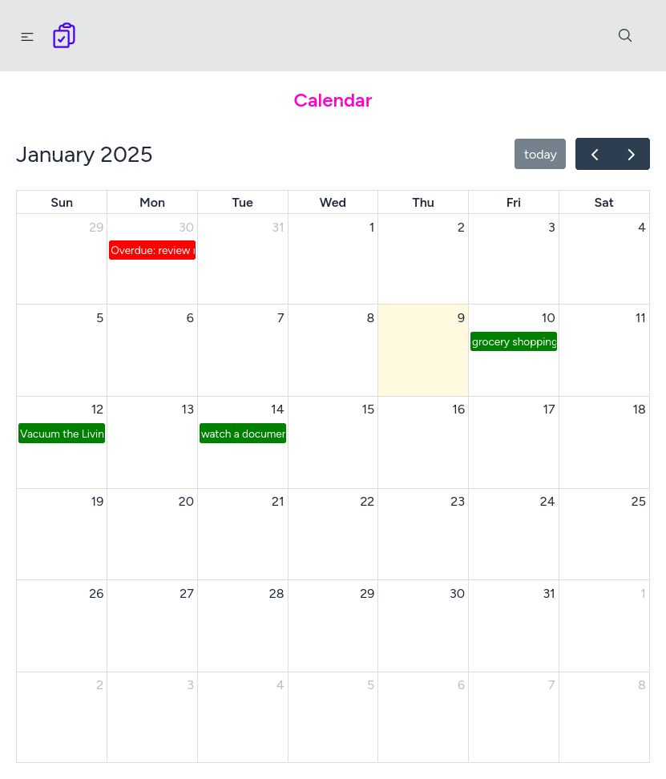
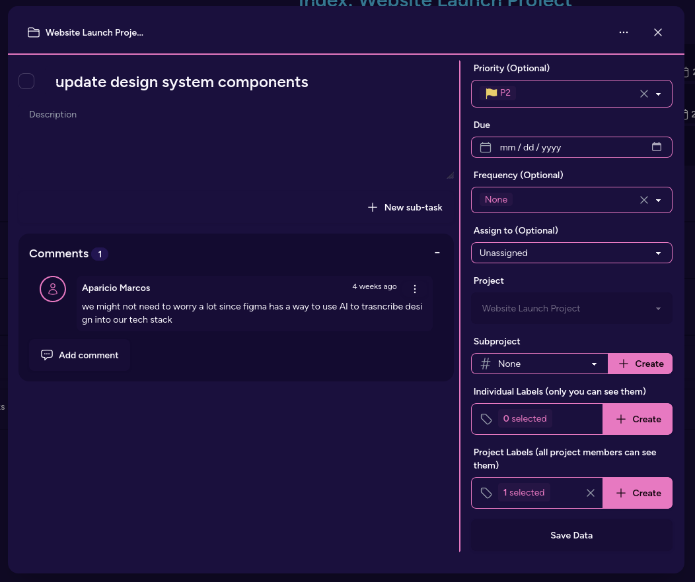
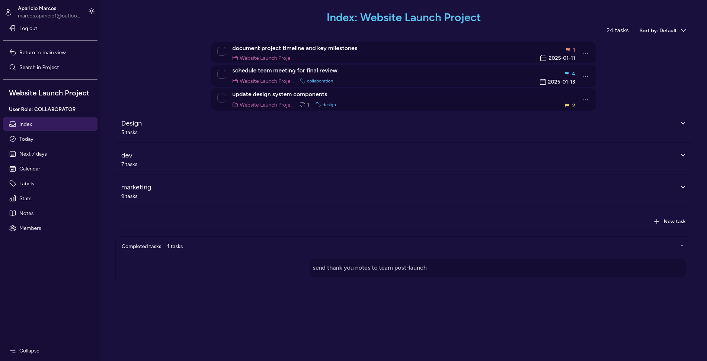
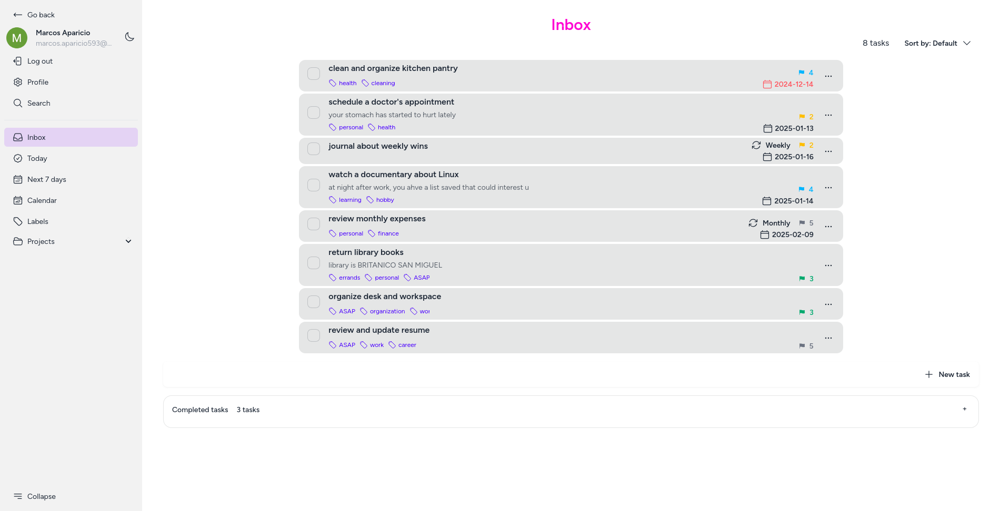
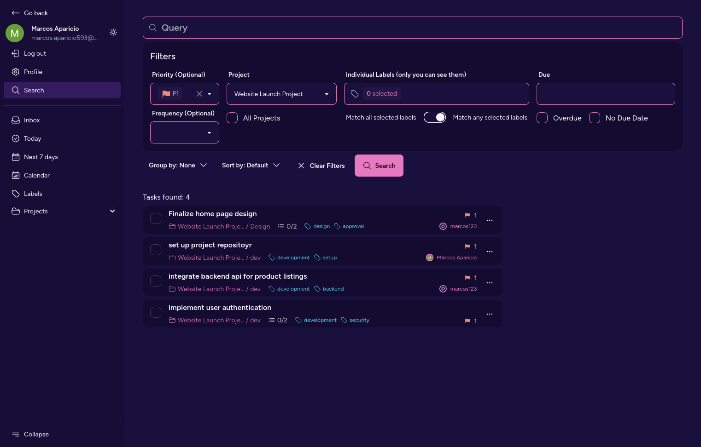

<div align="center">
  <h1 align="center" style="color: oklch(0.722105 0.159514 342.009);">💃 TaskTango</h1>
  <h4 align="center">Orchestrate your productivity with grace</h4>
</div>

TaskTango is a feature rich todolist application developed in Laravel with simple collaboration features.

### Table of Contents

- [Features](#features)
- [Development Setup](#development-setup)
    - [Using Laravel sail in UNIX-like shells](#using-laravel-sail-in-unix-like-shells)
- [Aclarations](#aclarations)
- [TODO](#todo)
- [Gallery](#gallery)

### Features

- Dark/Light theme support
- Project functionality with support for multiple members
- Useful metadata on tasks
- Search functionality across all individual and project tasks


### Development Setup

#### Using Laravel Sail in UNIX-like shells

**:warning: You must have docker installed in your system for this to work**

```bash
# clone the repository and cd into it
git clone git@github.com:marcos-aparicio/tasktango.git
cd tasktango
# copy .env.example to .env, make sure to check the port numbers that will be used
# so there isn't any problems with software you already have, particularly the APP_PORT and DB_PORT
cp .env.example .env
# install the dependencies
composer install
# start the containers
./vendor/bin/sail up -d
# create the application key
./vendor/bin/sail artisan key:generate
# install frontend dependencies
./vendor/bin/sail npm i
# compile frontend assets
./vendor/bin/sail npm run build # in case you are developing, you can use npm run dev instead
# apply database migrations
./vendor/bin/sail artisan migrate
# link storage to public
./vendor/bin/sail artisan storage:link
# now you should be able to go to localhost in your browser, or localhost:<port> if you change the default port
```

### Aclarations

1. If you want Google Oauth to work in your environment you must first create the neccesary API credentials for that. This [tutorial](https://fajarwz.com/blog/create-login-with-google-oauth-using-laravel-socialite/#configuration) should help you.

2. If you find a bug, have a question or suggestion feel free to drop an issue in this repo.

### TODO

- [x] Show website demo pictures on this file
- [ ] Show non-sail installation of the repo
- [ ] Clean code


### Gallery

Showing some pages that showcase the functionality of the website:



<span>Calendar view</span>
<hr/>


<span>Task modal showing metadata</span>
<hr/>



Project View

<hr/>


Inbox View

<hr/>


Search Functionality

